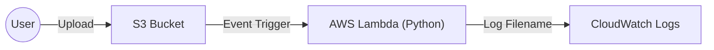

# Lambda S3 File Trigger (Python)
> Event-driven serverless automation for S3 bucket uploads.

## 🎯 Objective
This project implements a basic event-driven architecture where an AWS Lambda function is automatically triggered whenever a new file is uploaded to an S3 bucket.

## 🚀 Key Features
- **Serverless Automation:** Zero infrastructure to manage; function runs only on events.
- **Event Correlation:** Demonstrates how Lambda parses S3 metadata from event objects.
- **IAM Best Practices:** Uses the principle of least privilege for the Lambda execution role.

## 🏗️ Architecture


---

## 📁 Project Structure
```text
.
├── screenshots/    # Step-by-step implementation visuals
└── README.md       # Project documentation
```

---

## 🛠️ Tech Stack
- **Compute:** AWS Lambda (Python 3.10)
- **Storage:** Amazon S3
- **Monitoring:** CloudWatch Logs
- **Security:** IAM Roles

---

## 🔧 Setup & Steps

### 1. Create S3 Bucket


### 2. Lambda Function Code
Implement the Python logic to process the S3 event.


### 3. Configure Trigger
Ensure the Lambda function has permissions to be invoked by S3.


## ✅ Verification
Upload a file and monitor the execution in CloudWatch Logs.


---
Created by **Tunahan Koç** | [LinkedIn](https://www.linkedin.com/in/tunahan-koc-8b43b765/) | [GitHub](https://github.com/tnhkoc)
