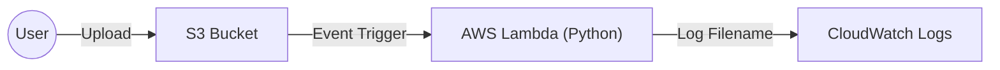

# Lambda S3 File Trigger (Python)
> Event-driven serverless automation for S3 bucket uploads.

## 🎯 Objective
This project implements a basic event-driven architecture where an AWS Lambda function is automatically triggered whenever a new file is uploaded to an S3 bucket.

## 🚀 Key Features
- **Serverless Automation:** Zero infrastructure to manage; function runs only on events.
- **Event Correlation:** Demonstrates how Lambda parses S3 metadata from event objects.
- **IAM Best Practices:** Uses the principle of least privilege for the Lambda execution role.

## 🏗️ Architecture

## 🛠️ Tech Stack
- **Compute:** AWS Lambda (Python 3.10)
- **Storage:** Amazon S3
- **Monitoring:** CloudWatch Logs
- **Security:** IAM Roles

## 🔧 Setup & Usage
1. Create an S3 bucket.
2. Create a Lambda function with the provided Python code.
3. Configure an S3 trigger on the Lambda function for `s3:ObjectCreated:*` events.

## ✅ Verification
- Upload any file to your S3 bucket.
- Check CloudWatch Log Groups to see the logged filename.

---
Created by **Tunahan Koç** | [LinkedIn](https://www.linkedin.com/in/tunahan-koc-8b43b765/) | [GitHub](https://github.com/tnhkoc)
