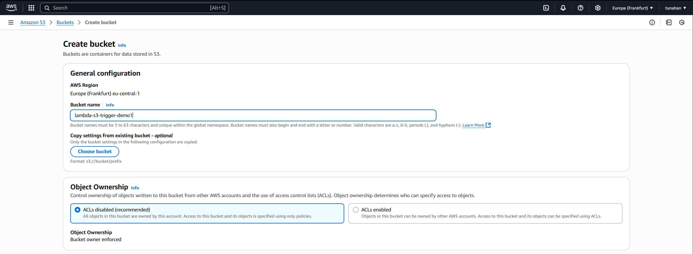
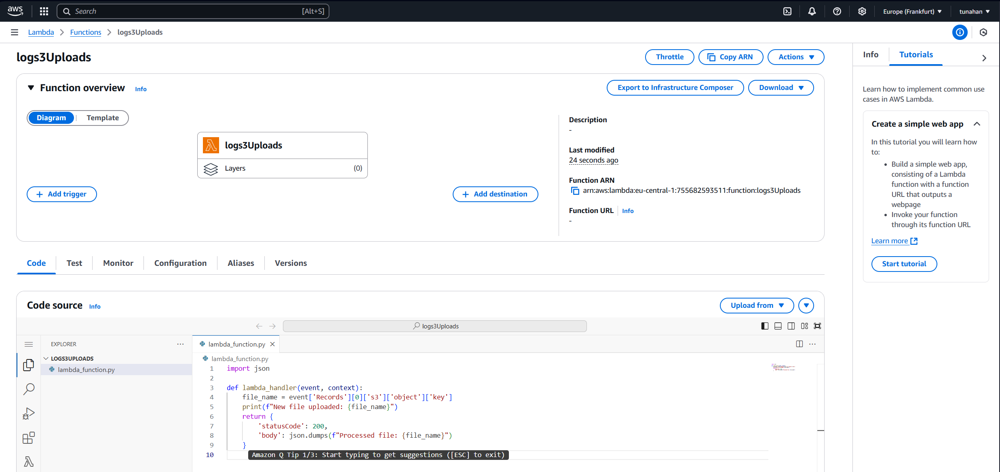
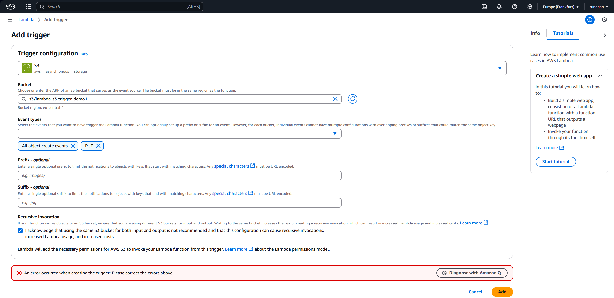
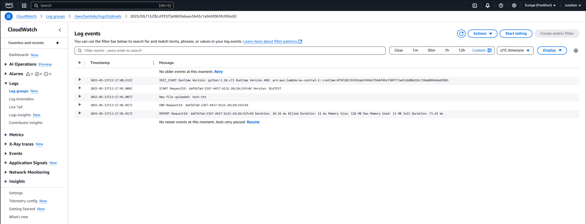

# 🪄 AWS Lambda – S3 Trigger Integration (Python)

This project demonstrates a basic event-driven architecture using AWS Lambda and Amazon S3. When a file is uploaded to a specific S3 bucket, the Lambda function is triggered and logs the file name to **Amazon CloudWatch**.

---

## ✅ Objective

- Understand how S3 triggers work with Lambda  
- Learn how to handle AWS events in Python  
- Practice role-based permissions using IAM  
- Monitor function execution via CloudWatch Logs  

---

## 🛠️ Services Used

- **Amazon S3** – Event source for uploads  
- **AWS Lambda** – Event-driven compute  
- **IAM** – Role for Lambda to access S3 and CloudWatch  
- **Amazon CloudWatch** – To log and view events  

---

## 📐 Architecture

1. File uploaded to S3  
2. S3 sends an event to Lambda  
3. Lambda function logs the filename  
4. Output visible in CloudWatch Logs  

---

## 🚀 Setup Instructions

### 1. Create an S3 Bucket  
- Go to the S3 console → **Create bucket**  
- Example name: `lambda-s3-trigger-demo1`  
- Ensure ACLs are disabled and public access is blocked  

📸 Screenshot:  


---

### 2. Create the Lambda Function  
- Go to Lambda Console → Create function  
- Runtime: `Python 3.10`  
- Permissions: Create a new role with **basic Lambda permissions**

Paste the following code:

```python
import json

def lambda_handler(event, context):
    file_name = event['Records'][0]['s3']['object']['key']
    print(f"New file uploaded: {file_name}")
    return {
        'statusCode': 200,
        'body': json.dumps(f"Processed file: {file_name}")
    }
```

📸 Screenshot:  


---

### 3. Add S3 as Trigger  
- In Lambda → Click **Add trigger**  
- Choose `Amazon S3`  
- Select the bucket created (`lambda-s3-trigger-demo1`)  
- Event type: `PUT`  
- Save

⚠️ If you get a permissions error make sure to check the box:  :  

**“I acknowledge that using the same S3 bucket for both input and output is not recommended...”**  
Otherwise, the trigger won't be created.

📸 Screenshot:  


---

### 4. Upload a File to S3  
- Upload a test file (e.g., `test.txt`) into the S3 bucket

---

### 5. Check Logs in CloudWatch  
- Go to **CloudWatch → Log Groups → /aws/lambda/your-function-name**  
- Verify that you see a log like: `New file uploaded: test.txt`

📸 Screenshot:  


---

## 📌 Notes

- This project demonstrates a simple event trigger setup  
- You can expand the Lambda to process file content, send notifications, or trigger other AWS services  
- Make sure the IAM role has:
  - `AmazonS3ReadOnlyAccess`
  - `AWSLambdaBasicExecutionRole`
